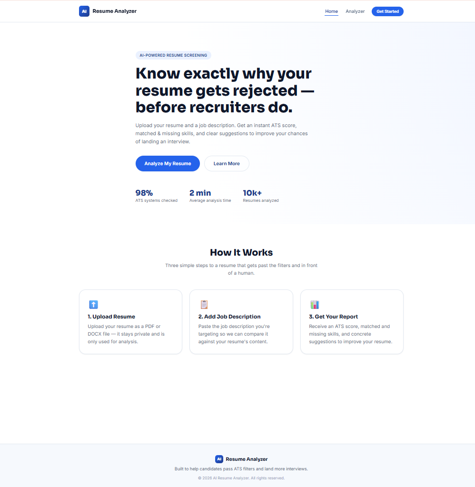
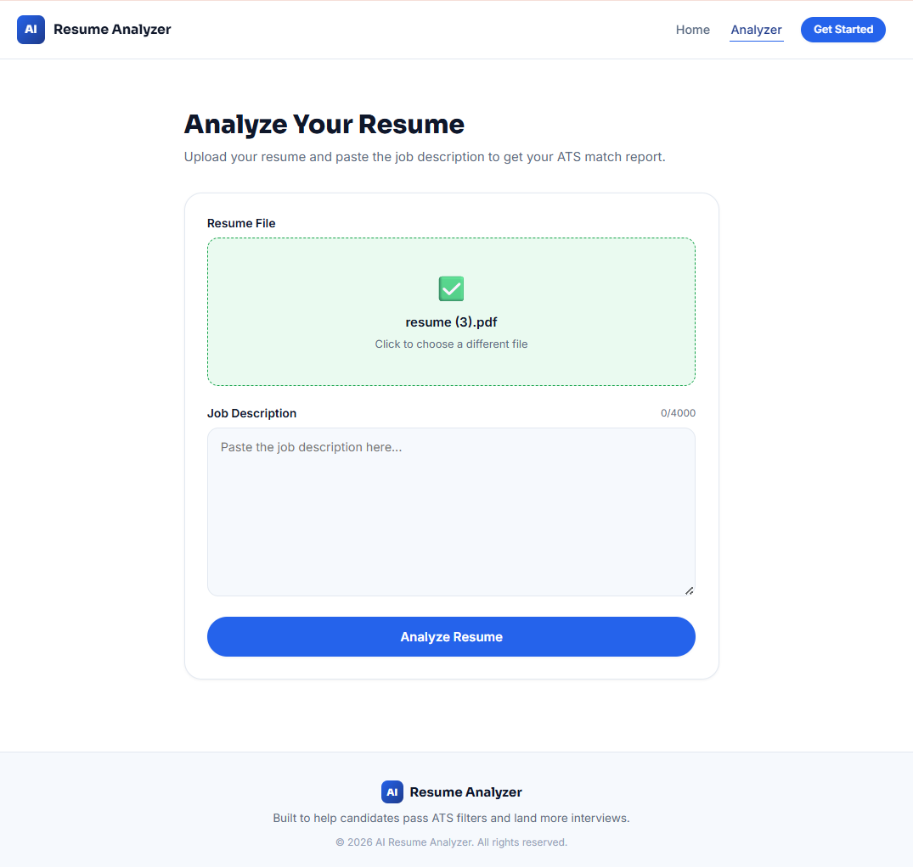
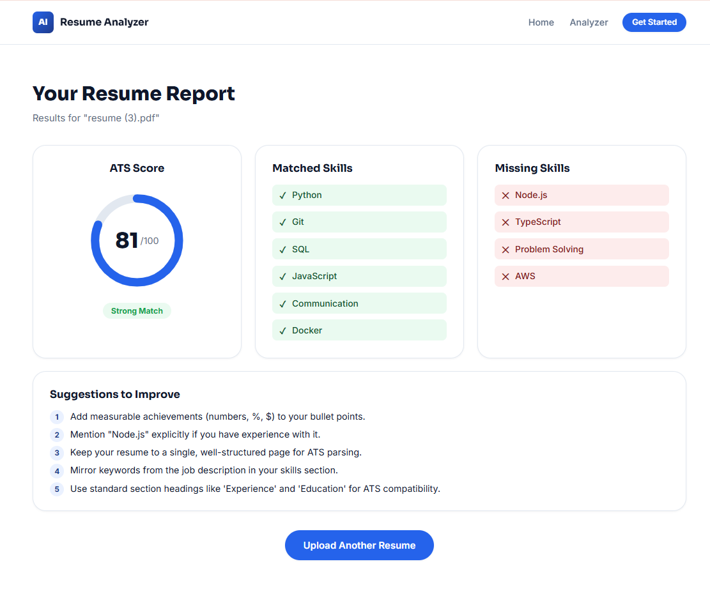

# 🤖 AI Resume Analyzer

A modern React.js web application that helps users analyze their resumes against a job description. The application provides an ATS (Applicant Tracking System) score, identifies matched and missing skills, and suggests improvements to increase interview chances.


## 📌 Features

- 📄 Upload Resume (PDF/DOCX)
- 📝 Enter Job Description
- 📊 ATS Score Display
- ✅ Matched Skills
- ❌ Missing Skills
- 💡 Resume Improvement Suggestions
- 📱 Fully Responsive Design
- 🎨 Modern User Interface
- ⚡ Fast Performance with Vite


## 🛠 Tech Stack

| Technology | Purpose |
|------------|---------|
| React.js | Frontend Framework |
| JavaScript (ES6+) | Programming Language |
| Vite | Build Tool |
| React Router DOM | Routing |
| Axios | API Requests |
| CSS3 | Styling |
| React Icons | Icons |


## 📂 Folder Structure

```
AI-Resume-Analyzer
│
├── public
│
├── src
│   ├── assets
│   ├── components
│   │   ├── Navbar.jsx
│   │   ├── Footer.jsx
│   │   ├── ResumeUpload.jsx
│   │   ├── JobDescription.jsx
│   │   ├── ATSScore.jsx
│   │   ├── MatchedSkills.jsx
│   │   ├── MissingSkills.jsx
│   │   └── Suggestions.jsx
│   │
│   ├── pages
│   │   ├── Home.jsx
│   │   ├── Analyzer.jsx
│   │   └── Results.jsx
│   │
│   ├── services
│   │   └── api.js
│   │
│   ├── App.jsx
│   └── main.jsx
│
├── package.json
├── vite.config.js
└── README.md
```


## 🚀 Installation

### Clone the Repository

```bash
git clone https://github.com/Namrutha20/AI-Resume-Analyzer.git
```

### Navigate to the Project

```bash
cd AI-Resume-Analyzer
```

### Install Dependencies

```bash
npm install
```

### Run the Application

```bash
npm run dev
```

Open:

```
http://localhost:5173
```


## 📷 Screenshots

### 🏠 Home Page




### 📄 Resume Upload




### 📊 Analysis Result




## 📖 How It Works

1. Upload your resume (PDF or DOCX).
2. Paste the job description.
3. Click **Analyze Resume**.
4. View your ATS score.
5. Review matched and missing skills.
6. Improve your resume based on suggestions.


## 🔮 Future Enhancements

- Spring Boot Backend Integration
- AI-powered Resume Analysis
- Resume Parsing
- PDF Report Generation
- Authentication
- Resume History
- Dark Mode
- Multi-language Support


## 👨‍💻 Author

**Namrutha Srinidhi T**

- GitHub: https://github.com/Namrutha20
- LinkedIn: https://www.linkedin.com/in/namrutha-srinidhi-t-746baa246


⭐ If you found this project useful, consider giving it a star!
